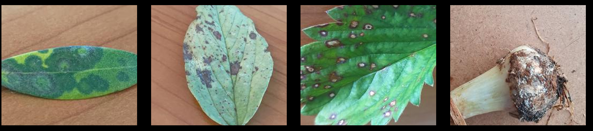
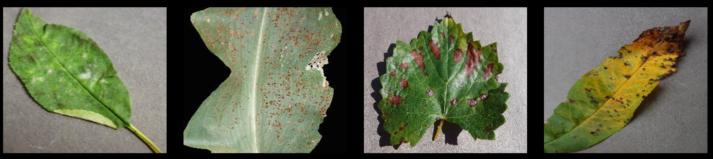

# 🌱 Image-Based Classification of Plant Diseases

This project focuses on **identifying and classifying plant diseases** using **Machine Learning** models and **Apache Spark**.  
The main goal is to assist farmers in **early disease detection**, a crucial step to prevent crop pandemics and the spread of plant diseases.  

It is a **multi-class classification task** involving **30 different disease classes**.

---

## 📂 Dataset

The dataset is a **combination of two main sources**:  
- **Personal dataset**  
  - 15,157 images across 16 different classes.  
  - 7 classes were integrated into the final dataset.  
  - The full dataset is also available on [Kaggle](https://www.kaggle.com/datasets/jessicafrabotta/plant-diseases-dataset-with-augmentation).

  

- **PlantVillage dataset**  
  - A popular benchmark dataset for plant disease classification.  
  - 23 classes were included in the final dataset.
 

  

➡️ **Final combined dataset**: **43,910 images**

---

## 🧠 Models Tested and Compared

Several **Machine Learning models** were trained and compared using **Spark**:

### 1. Convolutional Neural Network (CNN)
- Implemented with **Horovod** for distributed training on Spark DataFrames.  
- **Best performing model**.  
- **Results**:  
  - Accuracy: `0.92`  
  - Precision: `0.92`  
  - Recall: `0.92`  
  - F1 Score: `0.92`  

---

### 2. Multilayer Perceptron (MLP)
- Implemented natively in **PySpark**.  
- Activation functions: **Sigmoid** for hidden layers, **Softmax** for output.  
- **Results**:  
  - Accuracy: `0.65`  
  - Precision: `0.65`  
  - Recall: `0.66`  
  - F1 Score: `0.64`  

---

### 3. Random Forest
Two implementations were tested:

- **Simple Random Forest** (basic approach)  
  - Accuracy: `0.18`  
  - Precision: `0.24`  
  - Recall: `0.18`  
  - F1 Score: `0.12`  

- **Random Forest with DNN Featurization & Transfer Learning**  
  - Used **SynapseML** (formerly *MMLSpark*).  
  - Features extracted with a **pre-trained CNN on CIFAR-10 (32x32)**.  
  - Accuracy: `0.53`  
  - Precision: `0.53`  
  - Recall: `0.53`  
  - F1 Score: `0.53`  

---

## 💻 Final Application

A simple **Streamlit web app** was created to showcase the results.  
- Users can upload an image of a plant leaf 🌿.  
- The model predicts the **disease class**.  
- Code available in **`app.py`**.

---

## 🚀 Tech Stack
- **Apache Spark**  
- **Horovod**  
- **SynapseML**  
- **Streamlit**  
- **Python (ML / DL libraries)**  

---

## 📊 Performance Summary

| Model                                   | Accuracy | Precision | Recall | F1 Score |
|----------------------------------------|----------|-----------|--------|----------|
| Convolutional Neural Network (CNN)      | 0.92     | 0.92      | 0.92   | 0.92     |
| Multilayer Perceptron (MLP)             | 0.65     | 0.65      | 0.66   | 0.64     |
| Random Forest (basic)                   | 0.18     | 0.24      | 0.18   | 0.12     |
| Random Forest + DNN Featurization (CIFAR-10) | 0.53 | 0.53      | 0.53   | 0.53     |

## 📝 Final Remarks

As expected, the model with the best performance is the **Convolutional Neural Network (CNN)**, which is one of the most popular models in image classification tasks.  

Overall, the performance of the **Random Forest with DNN Featurization and Transfer Learning** was quite interesting, considering it works on very small images (32x32) and this task is highly sensitive to image size (the higher the resolution, the better the performance).  

It would have been extremely intriguing to try the same approach with a larger network, such as **AlexNet**, trained on bigger images.  
It also would have been interesting to test all these models with larger images while keeping the original idea of creating a very large dataset composed of both the **PlantVillage dataset** and the **personal dataset**.  

In general, having more resources would have left more room for further experimentation.  

---

## 🎥 Demonstrations  

Full [demo video](https://www.youtube.com/watch?v=5vb8_oCkY-Q)

---

